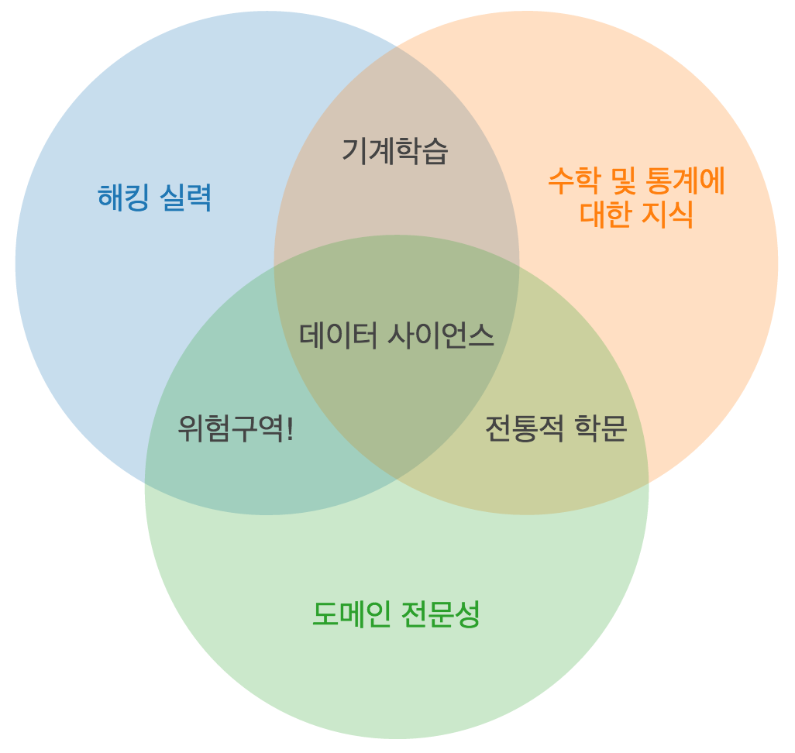

# 파이썬과 Pandas를 사용한 데이터 처리

## 프로젝트 목표
- 캐글을 활용하여 데이터 다운로드
- 데이터 사이언스 프로세스 활용
  
## 넷플릭스 주가 데이터 분석
> 데이터 전처리, 분석, 시각화를 하며 데이터 사이언스에 대해 학습

## 데이터 전처리

### A. 데이터 읽어오기
#### 1. 학습한 내용
- `Numpy`와 `Pandas` 패키지가 무엇인지와 어떻게 쓰는지
  - `Numpy`: 수학 계산용 패키지. Pandas와 Matplotlib을 사용하기 위해 활용되는 패키지
    - 행렬 연산 데이터가 많을수록 반복문에 비해 빠르다.
    - 다차원 행렬 자료 구조 제공
  - `Pandas`: 원하는 데이터만 추출하거나 데이터를 분석할 때 활용되는 패키지
    -  `Numpy`의 한계 보완
    -  `Series`(1차원 배열)과 `DataFrame`(2차원 배열)이라는 효율적인 자료구조 제공
#### 2. 어려웠던 부분
- CSV 파일의 첫번째 행의 내용을 데이터프레임의 행으로 들어가게 하기
  - 데이터프레임에서 각 열(column)의 이름될 부분이 파일의 첫번째 행으로 들어가 있어서 이를 따로 변수로 빼놓고(`columns=arr[0]`), 이를 제외한 부분을 데이터로 간주할 수 있게 해야한다(`arr = np.delete(arr, 0, 0)`).
  - 데이터와 함께 열의 이름으로 간주할 것을 인자로 넣어줘야한다(`df = pd.DataFrame(arr, columns=columns)`).

#### 3. 새로 배운 것들 및 느낀 점
- `pandas`를 사용하니 간편하고 보기 좋게 데이터를 나타낼 수 있구나 생각했다.
- 파일도 제대로 안 보고 무작정 `pd.DataFrame(arr)`를 하려고 했던 게 후회된다.. 주어진 파일을 제대로 좀 보자
  
---
### B. 2021년 이후의 종가 데이터 출력하기
#### 1. 학습한 내용
- `Matplotlib`: 그래프를 그려주는 패키지 학습
  - 다양한 종류의 그래프와 도표를 생성하고 데이터를 시각적으로 표현할 수 있다.
#### 2. 새로 배운 것들 및 느낀 점
- `to_datetime()`: 날짜 형식으로 반환해 날짜를 쉽게 처리.분석할 수 있다.
- `dt`라는 **열 접근자**를 통해 해당 열의 datetime 속성에 쉽게 접근할 수 있었다.
- `[]`를 통해 새로운 데이터프레임을 생성할 수 있다는 것을 알게 되었다.
  
## 데이터 분석

### D. 2021년 이후 월 별 평균 종가 출력하기
#### 1. 어려웠던 부분
- 메서드를 잘 모르고 행렬을 머릿속으로 그리기가 조금 어려워서 그런지 월 별 평균 종가를 어떻게 받아와서 출력할지가 어려웠다.

`monthly_avg_close = filtered_df.groupby(filtered_df['Date'].dt.to_period("M")).mean()['Close']`
  - `filtered_df['Date'].dt.to_period("M")`: Date 열을 월(Month) 단위의 기간으로 변환한다.
  - `filtered_df.groupby(...)`: 월 단위를 기준으로 한 서브 데이터프레임 생성(그룹화)
  - `.mean()['Close']`: 각 그룹(Month별)의 Close열의 평균 계산
  -> Close열의 평균값을 나타내는 시리즈 생성!

`result_df = pd.DataFrame({'Date': monthly_avg_close.index.to_timestamp(), 'Close': monthly_avg_close.values})`
  - `monthly_avg_close.index.to_timestamp()`: 월별로 그룹화된 시리즈의 인덱스(월)를 Timestamp로 반환
  - `monthly_avg_close.values`: Close 열의 값들 나타냄
  - `pd.DataFrame(...)`: 인덱스와 Close 열의 값을 이용해 새로운 데이터프레임 생성 

#### 2. 새로 배운 것들 및 느낀 점
- 보통 하나의 날짜만을 사용할 때는 Timestamp로 표현하고, 두 개 이상의 배열을 이룰 때에는 DatetimeIndex로 표현한다.

## 데이터 시각화

### E. 2022년 1월 이후 월 별 최고, 최저, 종가 시각화
#### 1. 새로 배운 것들 및 느낀 점
- 여러 그래프를 그리려면 여러 번의 `plt.plot()` 호출으로 추가 가능